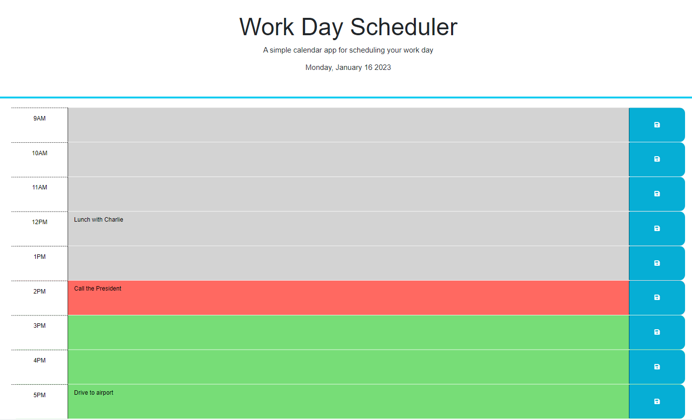

# Daily Planner

## Description
Daily Planner project consists in modifying a starter code provided for a daily planner so the user can save on a daily basis tasks for that day during business hours (9 AM to 5 PM). The JavaScript file was created using Day.js and jQuery libraries (starter code had 'TO DO' tips inside of a function). The time slots are colored coded according to the current hour (hour in the past - gray; hour in the present - red; hour in the future - green). This project is part of a challenge from Full Stack Coding Bootcamp at the University of Minnesota.

## Installation

N/A

## Usage
To add a new task, do the following:
* Click on the text area next to the hour you wish to do the task;
* Type a description of your task;
* Click on the save symbol on the right side of the text area.

Please note, if you add more than one task on different text areas for different time slots, only the ones that the save button is clicked will be saved.

## Credits

N/A

## License

Please refer to the LICENSE in the repo.

## Link to live website

## Website preview

<kbd></kbd>